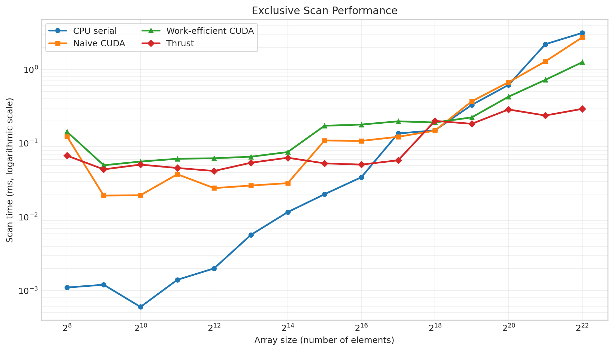

CUDA Stream Compaction
======================

**University of Pennsylvania, CIS 5650: GPU Programming and Architecture, Project 2**

* Zirui Liu
* Tested on: Windows 10, AMD Ryzen 7 5800H (8 cores, 16 threads), 16 GB RAM, NVIDIA GeForce RTX 3060 Laptop GPU 6 GB, Compute Capability 8.6, CUDA 13.3, Visual Studio 2022

## Project Description

This project implements exclusive prefix sum (scan) and stream compaction on both the CPU and GPU. Stream compaction removes all zero-valued elements from an input array. The GPU compaction implementation uses a map-scan-scatter pipeline to determine which elements should be retained and where they should be written in the output array.

## Features

* Serial CPU exclusive scan
* CPU stream compaction without scan
* CPU stream compaction using map, scan, and scatter
* Naive CUDA scan using global-memory double buffering
* Work-efficient CUDA scan using upsweep and downsweep
* Reduced kernel launch sizes at deeper levels of the work-efficient scan
* CUDA stream compaction using map, scan, and scatter
* Thrust `exclusive_scan` implementation
* Support for both power-of-two and non-power-of-two input sizes

## Performance Analysis

All performance measurements were collected using a Release x64 build without debugging. Initial and final memory allocation and transfer operations were excluded from the GPU timings.

### Block Size Optimization

Block sizes were tested using an input array of 2^20 (1,048,576) elements.

| Threads per block | Naive scan (ms) | Work-efficient scan (ms) |
| ---: | ---: | ---: |
| 32 | 1.257860 | 0.560960 |
| 64 | 0.807296 | 0.574496 |
| 128 | 0.832064 | 0.523680 |
| 256 | **0.763552** | **0.487040** |
| 512 | 0.772480 | 0.499776 |
| 1024 | 0.843008 | 0.546080 |

A block size of 256 produced the lowest measured runtime for both implementations and was therefore used for the remaining performance comparisons. Smaller block sizes required more blocks, while very large block sizes provided less scheduling flexibility. In these measurements, 256 threads per block provided the best balance.

### Work-Efficient Scan Optimization

At each upsweep and downsweep level, the implementation launches only enough threads for the active tree nodes. This avoids launching a full-size grid when most threads would be inactive at deeper levels. At 2^22 elements, the optimized work-efficient scan took 1.25242 ms, compared with 2.72157 ms for the naive CUDA scan and 3.1339 ms for the serial CPU scan.

### Scan Performance

The following graph compares the serial CPU scan, naive CUDA scan, work-efficient CUDA scan, and Thrust scan over array sizes from 2^8 to 2^22 elements. Both axes use logarithmic scales.



The serial CPU implementation was fastest for small arrays because its low execution time did not justify the overhead of launching multiple GPU kernels. As the input size increased, the GPU implementations became more competitive.

The naive CUDA implementation performs O(n log n) work and repeatedly reads and writes global memory across multiple kernel launches. Its runtime therefore increased more rapidly at large input sizes. The work-efficient implementation performs O(n) work and eventually outperformed the naive implementation, although its upsweep and downsweep phases require approximately twice as many kernel launches. For small arrays, this launch overhead outweighed the reduction in arithmetic work.

Thrust produced the lowest runtime for the largest inputs. At 2^22 elements, the measured times were 3.1339 ms for the CPU, 2.72157 ms for the naive CUDA scan, 1.25242 ms for the work-efficient CUDA scan, and 0.292128 ms for Thrust.

These scan algorithms perform relatively little arithmetic per memory access. Kernel-launch overhead dominates for small arrays, while global-memory traffic and the number of passes over the data become more important for large arrays. The measurements also contain some variation because each configuration was measured once and the shortest executions are especially sensitive to runtime overhead.

### Thrust Timeline

The Nsight Systems timeline showed `thrust::two_system_copy` ranges associated with host-to-device and device-to-host transfers when the host and device vectors were constructed and copied. These transfers occurred outside the timed `thrust::exclusive_scan` call.

The scan itself appeared as a short `thrust::exclusive_scan` range in the CCCL timeline and launched internal CUDA work asynchronously. The short scan region and the measured performance suggest that Thrust uses an optimized hierarchical scan implementation with fewer global-memory passes and less kernel-launch overhead than the naive and work-efficient implementations in this project.

### Additional Performance Tests

In addition to the provided correctness tests, I temporarily added benchmark loops to test block sizes from 32 to 1024 threads and array sizes from 2^8 to 2^22 elements. These benchmark changes were used only to collect the performance data and were not retained in the final `main.cpp`.

## Test Output

```text
****************
** SCAN TESTS **
****************
    [  31  29  19  33  42  26   6  35  36  30  27   1  36 ...  45   0 ]
==== cpu scan, power-of-two ====
   elapsed time: 0.0006ms    (std::chrono Measured)
    [   0  31  60  79 112 154 180 186 221 257 287 314 315 ... 6363 6408 ]
==== cpu scan, non-power-of-two ====
   elapsed time: 0.0003ms    (std::chrono Measured)
    [   0  31  60  79 112 154 180 186 221 257 287 314 315 ... 6313 6318 ]
    passed
==== naive scan, power-of-two ====
   elapsed time: 0.137216ms    (CUDA Measured)
    passed
==== naive scan, non-power-of-two ====
   elapsed time: 0.016512ms    (CUDA Measured)
    passed
==== work-efficient scan, power-of-two ====
   elapsed time: 0.14848ms    (CUDA Measured)
    passed
==== work-efficient scan, non-power-of-two ====
   elapsed time: 0.032768ms    (CUDA Measured)
    passed
==== thrust scan, power-of-two ====
   elapsed time: 0.068608ms    (CUDA Measured)
    passed
==== thrust scan, non-power-of-two ====
   elapsed time: 0.05136ms    (CUDA Measured)
    passed

*****************************
** STREAM COMPACTION TESTS **
*****************************
    [   3   1   1   1   2   0   2   1   0   2   3   3   2 ...   3   0 ]
==== cpu compact without scan, power-of-two ====
   elapsed time: 0.0007ms    (std::chrono Measured)
    [   3   1   1   1   2   2   1   2   3   3   2   1   2 ...   2   3 ]
    passed
==== cpu compact without scan, non-power-of-two ====
   elapsed time: 0.0008ms    (std::chrono Measured)
    [   3   1   1   1   2   2   1   2   3   3   2   1   2 ...   1   3 ]
    passed
==== cpu compact with scan ====
   elapsed time: 0.0049ms    (std::chrono Measured)
    [   3   1   1   1   2   2   1   2   3   3   2   1   2 ...   2   3 ]
    passed
==== work-efficient compact, power-of-two ====
   elapsed time: 0.188416ms    (CUDA Measured)
    passed
==== work-efficient compact, non-power-of-two ====
   elapsed time: 0.051424ms    (CUDA Measured)
    passed
```
